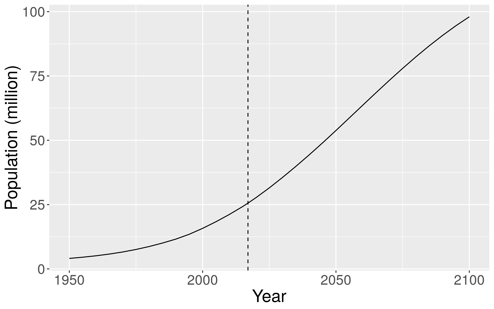
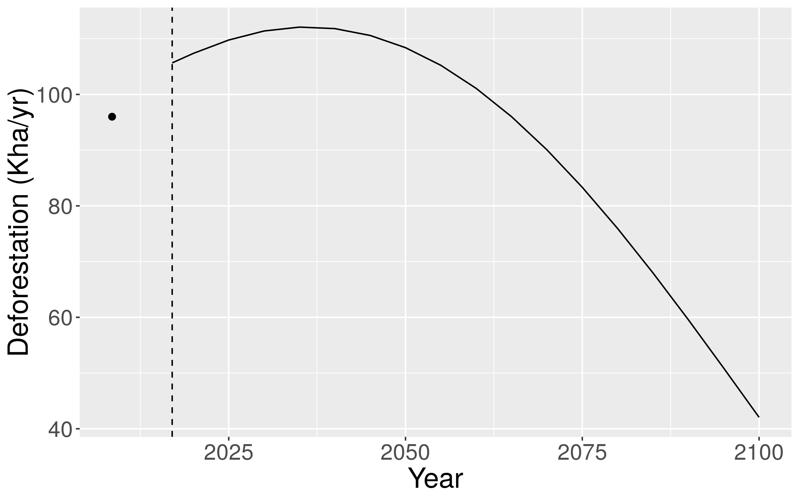
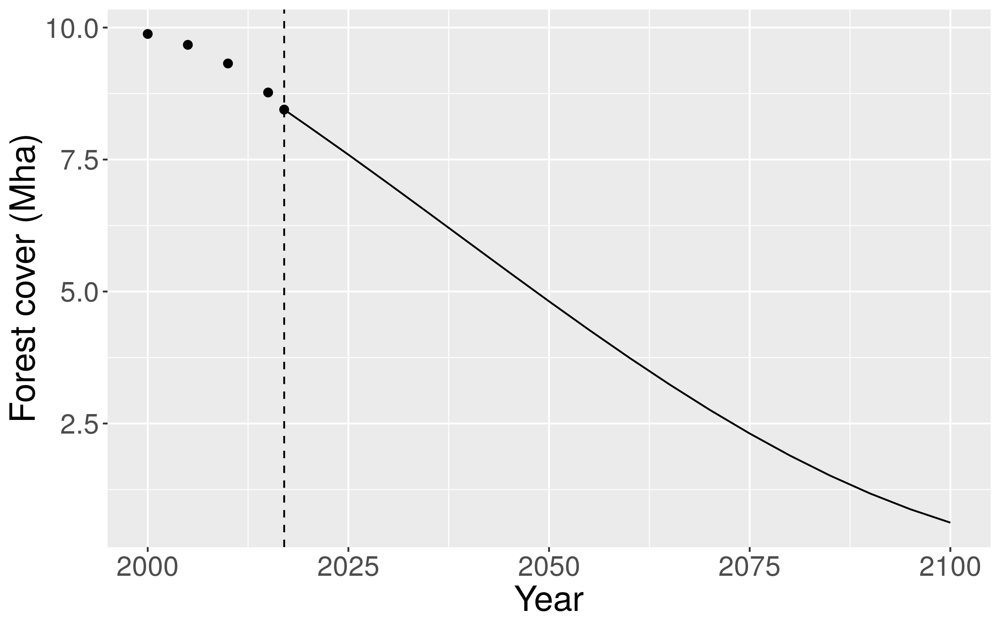

# Appendices

## Appendix 1: Mathematical formulas for accuracy indices

(ref:cap-confusion-matrix) **Confusion matrix used to compute accuracy indices.** A confusion matrix can be computed to compare model predictions with observations.\vspace{0.5cm} 

```{r confusion-matrix, results="asis", echo=FALSE}
df <- read.table("tables/confusion-matrix.txt", header=TRUE, sep=",")
vect.align <- rep("l",2)
col.names <- c("","","Observations","","Total")
options(knitr.kable.NA="")
knitr::kable(df, caption="(ref:cap-confusion-matrix)", booktabs=TRUE,
			 escape=FALSE,
			 col.names=col.names,
			 align=vect.align, linesep="") %>%
	kable_styling(latex_options=c("HOLD_position","striped"), full_width=FALSE, position="center")
```

(ref:cap-accuracy-indices) **Formulas used to compute accuracy indices.**. Several accuracy indices can be computed from the confusion matrix to estimate and compare models' predictive skill. We followed the definitions of @Pontius2008 for the FOM and @Liu2011 for the other indices. Note that the AUC relies on the predicted probabilities for observations 0 (non-deforested) and 1 (deforested), not on the confusion matrix. \vspace{0.5cm} 

```{r accuracy-indices, results="asis", echo=FALSE}
df <- read.table("tables/accuracy-indices.txt", header=TRUE, sep=",")
vect.align <- rep("l",2)
col.names <- c("Index","Formula")
knitr::kable(df, caption="(ref:cap-accuracy-indices)", booktabs=TRUE,
			 escape=FALSE,
			 col.names=col.names,
			 align=vect.align, linesep="") %>%
	kable_styling(latex_options=c("HOLD_position","striped"), full_width=FALSE, position="center")
```

## Appendix 2: Barnes model of deforestation intensity

(ref:cap-demo) **Demographic projections for Madagascar**. Projections come from the 2017 revision of the United Nation World Population Prospects [@UN2017]. In 2000, population in Madagascar was estimated at 15.8 M. In 2017 (vertical dashed line), it is estimated at 25.6 M. Projections indicate that population should roughly double from 2017 to 2050 (reaching 53.8 M in 2050) and quadruple from 2017 to 2100 (reaching 98.0 M in 2100).

```{r demo, out.width="\\textwidth", fig.cap="(ref:cap-demo)"}

```

(ref:cap-defor) **Projections of the deforestation intensity (Kha/yr) for Madagascar**. We used the following model adapted from @Barnes1990 (see section Materials and Methods for more details): $D_{t,t+1} = \text{exp}(-5.942 + 0.219/2 + 0.607 \log(F_t) + 0.493 \log(P_t))$ to iteratively forecast deforestation $D_{t,t+1}$ and forest cover $F_t$ from 2017 to 2100 using the United Nations population projections $P_t$ (shown in Fig. \@ref(fig:demo)). Deforestation is estimated at 106 Kha/yr in 2017 (vertical dashed line). Observed mean annual deforestation on 2000-2017 [@Vieilledent2018data] is represented with a black dot. Deforestation should increase until 2040 (to reach about 112 Kha/yr) due to fast population growth and relatively high forest cover ($>=$ 6 Mha, see Fig. \@ref(fig:forest)). After 2040, deforestation should decrease due to slower population growth and lower residual forest cover ($<$ 6 Mha). Despite this decrease, deforestation should remain high for several decades ($>=$ 100 Kha/yr until 2060, and $>=$ 90 Kha/yr until 2075).

```{r defor, out.width="\\textwidth", fig.cap="(ref:cap-defor)"}

```

(ref:cap-forest) **Projections of the natural forest cover (Mha) for Madagascar**. We used the following model adapted from @Barnes1990 (see section Materials and Methods for more details): $D_{t,t+1} = \text{exp}(-5.942 + 0.219/2 + 0.607 \log(F_t) + 0.493 \log(P_t))$ to iteratively forecast deforestation $D_{t,t+1}$ and forest cover $F_t$ from 2017 to 2100 using the United Nations population projections $P_t$ (shown in Fig. \@ref(fig:demo)). Forest cover observations for 2000, 2005, 2010, 2015, and 2017 [@Vieilledent2018data] are represented with black dots. The natural forest covers 8.4 Mha in 2017 (vertical dashed line). The model predicts that forest should cover 4.8 Mha in 2050 and less than 1 Mha (622,000 ha) in 2100.

```{r forest, out.width="\\textwidth", fig.cap="(ref:cap-forest)"}

```

\newpage